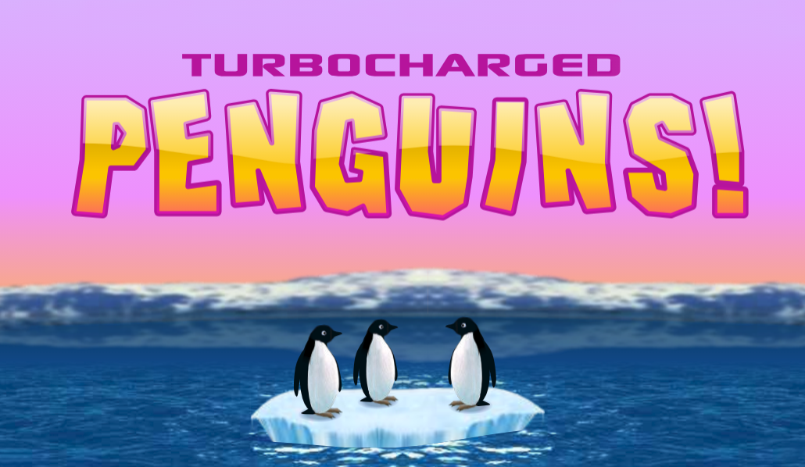

<br>
<br>
<br>
<br>
<p align="center">
  
</p>
<h3 align="center">Turbocharged Penguins – Revived in Pure JavaScript！</h1>
<p align="center">Made with ❤️ by <a href="https://github.com/lingyicute">lingyicute</a></p>
<br>
<br>
<br>

## About

An unofficial, faithful HTML5 remake of the 2006 Flash game **Turbocharged Penguins** — a one-button arcade game about launching a penguin into the sky and keeping it airborne by clicking it mid-flight.

The game was reverse-engineered from the original SWF: the vector artwork is exported from the original file, the Flash timeline semantics (`stop()`, `play()`, `gotoAndStop()`, frame scripts, frame sounds) are re-implemented on Canvas 2D, and the physics constants are transcribed from the original ActionScript 1/2 sources. The result looks, plays and sounds like the original — and runs entirely in the browser with no plugins, no server and no dependencies.

## Play

- **Online:** <https://tp.92li.uk/>
- **Offline:** open [`index.html`](index.html) directly in any modern browser. It is a fully self-contained single file — artwork and audio are embedded, no web server needed.

## Gameplay

1. Pick one of the three penguins on the ice floe (click/tap, or press `1`–`3`).
2. Your penguin tumbles down the cliff face. **Click or tap it to bounce it back up** — every bounce sends it higher and adds a little spin.
3. Collect the turbo pickups on the cliff wall: they add or multiply your banked turbo charges.
4. With charges banked, hit the **TURBOCHARGE** button (or press `Space`) to rocket upward — multiple charges give you a sustained, steerable boost.
5. Don't fall past the bottom of the screen. Your score is the highest point reached, in meters; your best record is saved locally and marked on the cliff wall in later runs.

### Controls

| Input | Action |
| --- | --- |
| Click / tap the penguin | Bounce it upward |
| Click / tap a pickup | Collect the bonus |
| TURBOCHARGE button or `Space` (in game) | Use banked turbo charges |
| `1` `2` `3` | Choose penguin 1 / 2 / 3 on the select screen |
| `Space` / `Enter` | Confirm menus and panels |
| `M` or the speaker icon | Mute / unmute |

## Features

- Faithful recreation of the full game flow: intro cinematic, menu, penguin select, gameplay, and all result/record panels
- Original artwork, animations and sound, driven by a re-implemented Flash timeline engine (620×360 stage @ 36 fps logical frame rate, 12 ms physics steps)
- Pointer *and* keyboard input; touch-friendly
- Crisp rendering at any size — HiDPI/Retina aware, native device resolution with no DPR cap
- Web Audio engine with sample-accurate MP3 encoder-delay compensation, seamlessly stitched looping music, `<audio>` fallback paths and first-gesture autoplay unlock
- Single-file offline build, zero runtime dependencies

## Run from source

`dev.html` is the multi-file development page. Serve the repository root with any static server (audio is fetched at runtime):

```bash
python3 -m http.server 8000
# then open http://localhost:8000/dev.html
```

## Build the single file

```bash
python3 build_singlefile.py
```

Reads `dev.html` plus `src/` and `assets/`, embeds all audio as `data:` URIs, and writes the self-contained `index.html`. (Note: `index.html` is a generated artifact — edit the sources, not the build.)

## Tests

```bash
node --test tests/        # 17 unit tests, no dependencies
```

Optional Playwright harnesses (compare against an unmodified checkout):

```bash
npm install --no-save playwright && npx playwright install chromium

# deterministic A/B comparison: timeline state + pixel diffs over 240 ticks
node tests/visual-regression.cjs http://localhost:8000/baseline/ http://localhost:8000/candidate/

# startup benchmark under 4x CPU throttling (long tasks, render p95, V8 profile)
node tests/startup-benchmark.cjs http://localhost:8000/index.html ./results/before
```

## Project structure

```
├── dev.html               # multi-file development page
├── index.html             # generated self-contained build
├── build_singlefile.py    # dev.html → index.html (audio embedded as data: URIs)
├── src/
│   ├── game.js            # main loop, input handling, game-flow state machine
│   ├── physics.js         # physics transcribed from the original AS1/2 sources
│   ├── renderer.js        # binds game state to the exported art; raster cache, HiDPI
│   ├── timeline.js        # Flash timeline semantics: stop/goto/play, frame scripts
│   ├── audio.js           # Web Audio manager (delay trim, loop stitching, fallbacks)
│   ├── f-data.js          # frame sound cues and frame labels
│   └── style.css
├── assets/
│   ├── f-art.js           # vector artwork exported from the original SWF
│   ├── canvas-core.js     # export runtime (paths, filters, color transforms), hand-tuned
│   └── audio/             # sound rips from the original game (mp3/wav)
└── tests/                 # node:test units + Playwright regression & benchmark
```

### How it works, in short

- **Art:** `f-art.js` is a display-list export of the original SWF — every shape, bitmap and morph as Canvas path data. `canvas-core.js` provides the runtime (path parsing, blend modes, color transforms, bitmap filters) and has been hand-tuned with a canvas pool and rasterization cache.
- **Timelines:** the export has no notion of `stop()`/`gotoAndPlay()`, so `timeline.js` gives every clip instance its own playhead and re-implements the original frame scripts and per-frame sound cues (`src/f-data.js`).
- **Renderer:** `renderer.js` hooks the export's `place()` calls and re-binds them to live game state (penguin position, camera, tiles, bonuses), rasterizing static vector art into device-resolution bitmaps for speed.
- **Audio:** effects play through pre-decoded Web Audio buffers trimmed of MP3 encoder delay; the music bed and intro sting are silence-trimmed and crossfade-stitched for gapless looping, with an `HTMLMediaElement` fallback if Web Audio is unavailable.

## Original game

*Turbocharged Penguins* is a Flash game released in October 2006 (distributed via Optus Pre-Paid). This project is a non-commercial fan effort to preserve it after the death of Flash; it is not affiliated with or endorsed by the original authors. See [NOTICE](NOTICE) for asset attribution.

## License & disclaimer

- **Code** (`src/`, `tests/`, build tooling) is licensed under the [AGPL3.0 License](LICENSE).
- **Original game assets** (artwork in `assets/f-art.js`, audio in `assets/audio/`, and the embedded copies inside `index.html`) are *not* covered by the AGPL3.0 license — they remain the property of their original owners and are included for archival purposes only. See [NOTICE](NOTICE) for details and a takedown contact.

## 中文说明

这是 2006 年 Flash 小游戏《Turbocharged Penguins》的 HTML5 完全复刻版：从原版 SWF 逆向还原了美术、时间轴逻辑与物理参数，纯 Canvas 2D 实现，无任何依赖。`index.html` 是内置全部音频的单文件版，双击即可离线游玩；在线版见 <https://tp.92li.uk/>。本项目为非商业性质的存档致敬作品，与原版权方无关——代码按照 AGPL3.0 许可，原版资产版权归属原作者，详见 [NOTICE](NOTICE)。
